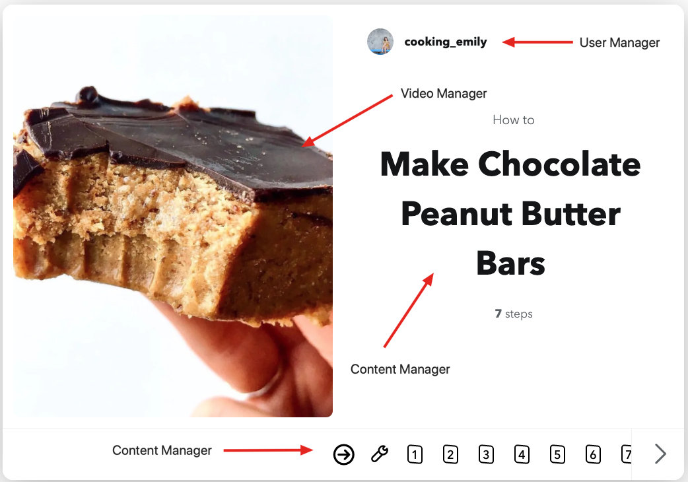

# Backend API Relationship

## Step 1 - Visit Website

**Related APIs:**







## Step 2 - Watch Video

**Related APIs:**









## Step 3 - Learning

**Related APIs:**







## Step 4 - Delight

**Related APIs:**







