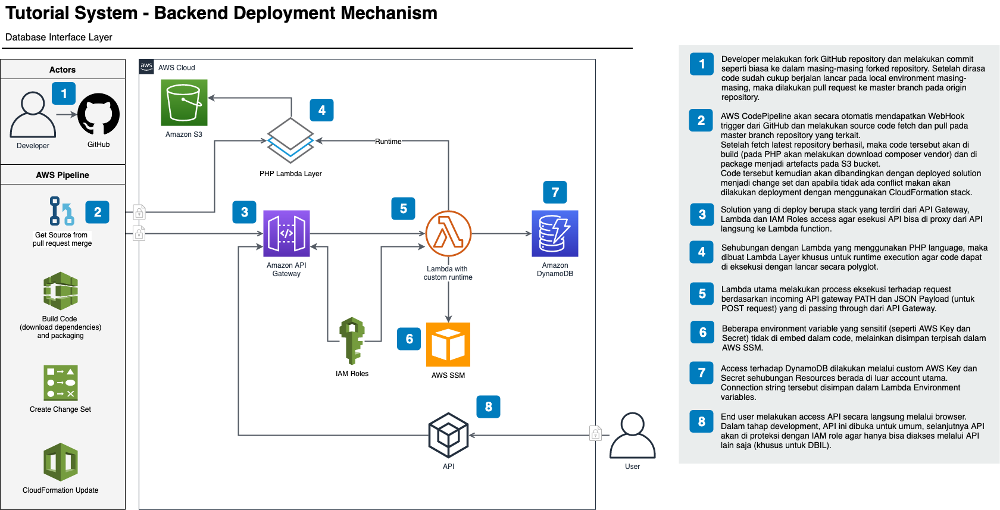

# Infrastructure as a Code

## Description

This documentation contains steps to deploy a CICD pipeline which deploys the backend APIs solution as part of the Infrastucture as a Code \(IaaC\).

The backend solution created in the GitHub repositories and sets up as WebHook into the Pipeline to trigger lambdas functions deployment by using CloudFormation template.

This solution alerts on pull request events for all repositories in the account that the solution is deployed into via slack \(if setup correctly\).

Herewith the high level architecture of the implementation of this backend IaaC:



## Getting Started

It is not possible to deploy this solution locally, only using a CICD pipeline in an AWS account or using a SBX to deploy the solution only. See installing options below for instructions on how to deploy this solution.

The CICD pipeline should be used to deploy the solution into the below accounts.

### Prerequisites Components

Before you can use the code in this repository you must install git.

macOS example:

```text
brew install git
```

Install AWS CLI:

```text
pip install awscli
```

Have an AWS account already created with a CICD access key ID and secret access key available.

### Pre-requisite files for deploying to production

* Get the example of the bootstrap Makefile from the following link: [https://github.com/pojok-projects/tutorialsystem-database-interface-layer/blob/master/Makefile](https://github.com/pojok-projects/tutorialsystem-database-interface-layer/blob/master/Makefile) 
* Get the example of the IaaC pipeline.yaml from the following link: [https://github.com/pojok-projects/tutorialsystem-database-interface-layer/blob/master/pipeline.yaml](https://github.com/pojok-projects/tutorialsystem-database-interface-layer/blob/master/pipeline.yaml) 
* Get the example of the CloudFormation template solution.yaml from the following link: [https://github.com/pojok-projects/tutorialsystem-database-interface-layer/blob/master/solution.yaml](https://github.com/pojok-projects/tutorialsystem-database-interface-layer/blob/master/solution.yaml)

### File Descriptions

* pipeline.yaml - Contains CFN for CICD pipeline 
* solution.yaml - Contains CFN for main solution 
* Makefile - Contains the bootstrap executable file to deploy the pipeline.yaml, which then build and deploy the solution.yaml

### Deployment mechanism

Copy all the files from link above and modify the makefile example from the link above and perform some modifications.

Please set the access key credentials:

```text
The following access key need to be added into the ~/.aws/credentials file:
```

\[pojokan\] aws\_access\_key\_id =  aws\_secret\_access\_key = 

```text

```

Set environment variables:

```text
The AWS cli profile for with access to a CICD account role:
```

export AWS\_PROFILE=pojokan

```text

```

Set the makefile parameter values.

```text
Ensure the solution name is correct:
```

SolutionNaming=""

```text
Ensure the RepositoyName is correct:
```

RepositoyName=""

```text
Ensure the SlackChannel is correct:
```

SlackChannel="\#pullrequests"

```text
Ensure the SlackIcon is correct:
```

SlackIcon=":aws-codecommit"

```text
Ensure the SlackURL is correct:
```

SlackURL=""

```text

```

To deploy CICD pipeline:

```text
$ make deploy GitHubOAuthToken=<github-access-token>
```

To track status on pipeline creation:

```text
$ make _events
```

To get output the cloudformation outputs for the CICD pipeline:

```text
$ make _output
```

### Updating production solution

To deploy a code update for the CICD pipeline run:

```text
$ make update GitHubOAuthToken=<github-access-token>
```

To deploy a code update for the solution simply commit your code to the GitHub repository.

### Running CFN tests

To run a syntax test on CFN templates for the CICD pipeline and solution:

```text
$ make test
```

IMPORTANT: To test the solution the code deploy will run the solution in the AWS account.

## References

### CodeCommit How To

* [Pull Request Overview](https://docs.aws.amazon.com/codecommit/latest/userguide/pull-requests.html) 
* [Creating a pull request](https://docs.aws.amazon.com/codecommit/latest/userguide/how-to-create-pull-request.html) 
* [View a pull request](https://docs.aws.amazon.com/codecommit/latest/userguide/how-to-view-pull-request.html) 
* [Review a pull request](https://docs.aws.amazon.com/codecommit/latest/userguide/how-to-review-pull-request.html) 
* [Update a pull request](https://docs.aws.amazon.com/codecommit/latest/userguide/how-to-update-pull-request.html) 
* [Close a pull request](https://docs.aws.amazon.com/codecommit/latest/userguide/how-to-close-pull-request.html) 
* [Working with commits](https://docs.aws.amazon.com/codecommit/latest/userguide/commits.html) 
* [Working with branches](https://docs.aws.amazon.com/codecommit/latest/userguide/branches.html) 

## Built With

CICD:

* [CodePipeline](https://aws.amazon.com/codepipeline/?sc_channel=PS&sc_campaign=acquisition_AU&sc_publisher=google&sc_medium=codepipeline_b&sc_content=codepipeline_e&sc_detail=codepipeline&sc_category=code_pipeline&sc_segment=159815530925&sc_matchtype=e&sc_country=AU&s_kwcid=AL!4422!3!159815530925!e!!g!!codepipeline&ef_id=U-GV4gAAAcit3w06:20180514013441:s) 
* [S3](https://aws.amazon.com/s3/?sc_channel=PS&sc_campaign=acquisition_AU&sc_publisher=google&sc_medium=s3_b&sc_content=s3_e&sc_detail=aws%20s3&sc_category=s3&sc_segment=175046139817&sc_matchtype=e&sc_country=AU&s_kwcid=AL!4422!3!175046139817!e!!g!!aws%20s3&ef_id=U-GV4gAAAcit3w06:20180514013507:s) 

Solution:

* [Lambda](https://aws.amazon.com/lambda/?sc_channel=PS&sc_campaign=acquisition_AU&sc_publisher=google&sc_medium=lambda_b&sc_content=lambda_e&sc_detail=aws%20lambda&sc_category=lambda&sc_segment=221313933066&sc_matchtype=e&sc_country=AU&s_kwcid=AL!4422!3!221313933066!e!!g!!aws%20lambda&ef_id=U-GV4gAAAcit3w06:20180514012145:s) 
* [Cloudwatch](https://aws.amazon.com/cloudwatch/?sc_channel=PS&sc_campaign=acquisition_Au&sc_publisher=google&sc_medium=cloudwatch_b&sc_content=cloudwatch_p&sc_detail=cloudwatch&sc_category=cloudwatch&sc_segment=208324178784&sc_matchtype=p&sc_country=AU&s_kwcid=AL!4422!3!208324178784!p!!g!!cloudwatch&ef_id=U-GV4gAAAcit3w06:20180514012222:s) 
* [Cloudformation](https://aws.amazon.com/cloudformation/?sc_channel=PS&sc_campaign=acquisition_AU&sc_publisher=google&sc_medium=cloudformation_b&sc_content=cloudformation_e&sc_detail=aws%20cloudformation&sc_category=cloudformation&sc_segment=159811816921&sc_matchtype=e&sc_country=AU&s_kwcid=AL!4422!3!159811816921!e!!g!!aws%20cloudformation&ef_id=U-GV4gAAAcit3w06:20180514012257:s) 

