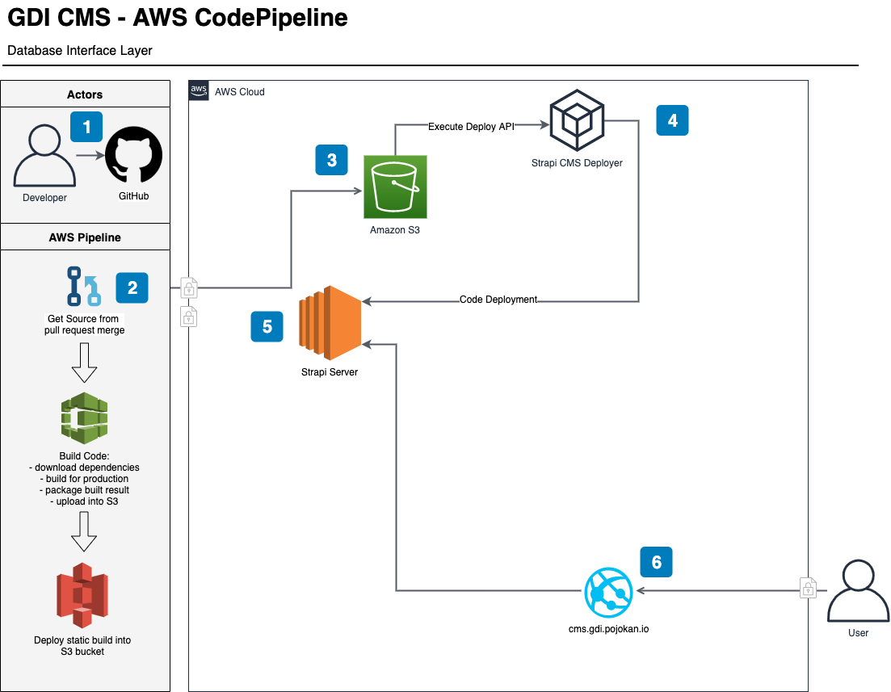

# Setup AWS CodePipeline for Strapi

## Description

AWS CodePipeline adalah rangkaian dari Infrastructure as a Code yang merupakan bagian dari Continuously Integration \(CI\) dan Continuously Deployment \(CD\) pipeline untuk process deployment dari code commit pada GitHub repository \(pada master branch\) secara otomatis ke AWS infrastructure tanpa human intervention.

Adapun AWS CodePipeline setup untuk Strapi deployment berada pada lokasi berikut:

[https://ap-southeast-1.console.aws.amazon.com/codesuite/codepipeline/pipelines/gdi-cms-master-cicd-pl/view?region=ap-southeast-1](https://ap-southeast-1.console.aws.amazon.com/codesuite/codepipeline/pipelines/gdi-cms-master-cicd-pl/view?region=ap-southeast-1)

## High Level Diagram

Berikut ini adalah high level diagram dari AWS CodePipeline untuk process deployment Strapi CMS ini:

Berikut ini adalah penjelasan dari step-step pada diagram di atas:

1. Developer melakukan fork GitHub repository dan melakukan commit seperti biasa ke dalam masing-masing forked repository. Setelah dirasa code sudah cukup berjalan lancar pada local environment masing-masing, maka dilakukan pull request ke master branch pada origin repository.
2. AWS CodePipeline akan secara otomatis mendapatkan WebHook trigger dari GitHub dan melakukan source code fetch dan pull pada master branch repository yang terkait. Setelah fetch latest repository berhasil, maka code tersebut akan di build \(pada node.js akan melakukan download dependency dan build production files\) dan di package menjadi artefacts pada S3 bucket.
3. Hasil packaging dari build artefact pada step nomor 2 diatas selanjutnya akan di deploy ke S3 bucket: cms.gdi.pojokan.io.
4. Dalam process restart, API pada Strapi CMS Deployer akan di execute yang mana akan melakukan process download S3 bucket artifact dan replace existing gdi-cms directory.
5. Strapi server yang telah mendapatkan code deployment akan melakukan process restart secara otomatis untuk melakukan implementasi code changes.
6. User akan melakukan access terhadap website melalui URL: http://cms.gdi.pojokan.io/gdidashboard. 

## Step by step of the GDI CMS CodePipeline

Code Pipeline untuk GDI CMS ini terdiri dari beberapa components:

### Source

Source adalah process trigger secara otomatis melalui GitHub Repository GDI CMS melalui repository berikut:



yang secara otomatis akan men-trigger CI/CD pipeline deployment apabila dilakukan pull request approval atau code commit pada master branch.

Berikut ini contoh code commit yang dibuat dalam GitHub repository:

Maka script update tersebut akan melakukan process trigger terhadap source step pada AWS CodePipeline:

### Build

Pada process build, dilakukan compilation terhadap code melalui predefined CodePipeline CloudFormation stack yang sudah dibuat dari code berikut:

[https://github.com/Pojokan-Guru-Ahli/gdi-cms/blob/master/pipeline.yaml](https://github.com/Pojokan-Guru-Ahli/gdi-cms/blob/master/pipeline.yaml)

Adapun commands yang di-eksekusi pada tahap ini adalah:

Dengan waktu timeout selama 10 menit. 

Berikut ini screen shot pada AWS CodePipeline untuk tahap ini:

### Deploy

Process deploy adalah tahap dimana hasil code build diatas disimpan sebagai artifact pada S3 bucket untuk dilakukan deployment pada server CMS Strapi.

Berikut ini screen shot pada AWS CodePipeline untuk tahap ini:  

Berikut ini adalah artifact hasil deployment ini yang berhasil di simpan di S3 bucket:

### Restart

Setelah artifact dibuat, process terakhir adalah melakukan copy dari hasil build diatas ke dalam server menggantikan script yang ada sebelumnya di server.

Berikut ini adalah script yang eksekusi pada process ini:



Berikut ini adalah snippet code untuk process deployment + restart dari script di atas:

